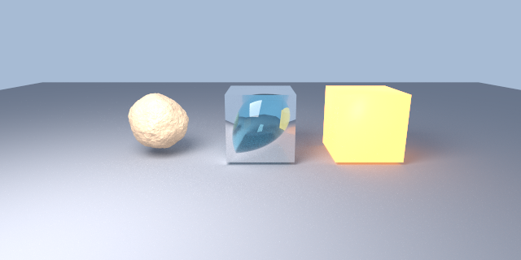
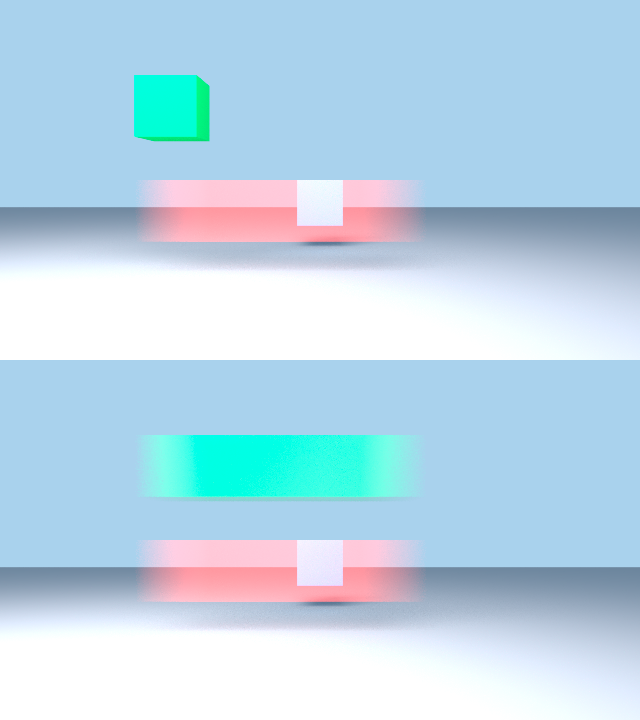
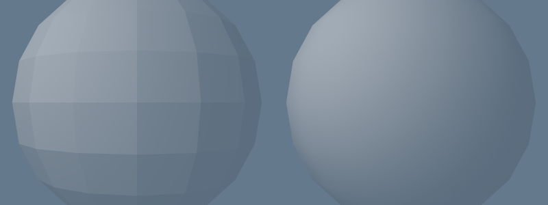

# État d'avancement

## Phase 0 — Build ✅

Cycles 5.2 (`3b97e190`) compile et s'installe contre **Houdini 22.0.368 / USD 26.05**.

- Configuration CMake : aucune erreur, aucun conflit TBB/OIIO/OpenVDB.
- Un correctif nécessaire : `patches/0001-FindUSDHoudini-add-hdsi.patch`.
- Sortie : `install/houdini/dso/usd/hdCycles.dll` (10 Mo) + `plugInfo.json`
  + package `cycles.json`.

Lancement :

    $env:PXR_PLUGINPATH_NAME = "<projet>/install/houdini/dso/usd_plugins"

`husk --list-renderers` affiche alors `HdCyclesPlugin (Cycles)`, **non marqué
"unsupported"**.

## Phase 1 — Delegate enregistré ✅

## Phase 2 — Première image ✅

Rendu par : `husk --renderer HdCyclesPlugin --camera /world/camera --res 480 270
--output geo.exr geo_only.usda`

Validé : mesh polygonaux, transforms, DomeLight (couleur + intensité),
displayColor, ombres de contact, path tracing sur 128 threads
(Threadripper 3995WX), échantillonnage adaptatif.

## Phase 3 — Lumières, instancing, subdivision ✅

Validé sur `tests/usd/phase3.usda` :

- **Subdivision Catmull-Clark** — le cube de gauche est rendu comme une sphère
  lisse, le cube central (`subdivisionScheme = "none"`) reste dur.
- **PointInstancer** — les 5 instances sont rendues, avec la couleur du
  prototype (après correctif 0003).
- **RectLight, DiskLight, SphereLight** — les trois contribuent, avec leurs
  couleurs et leurs ombres douces respectives.
- **displayColor** par objet.

Méthode : chaque résultat est contre-vérifié en rendant la même scène avec
Karma. C'est ce qui a permis de distinguer un vrai bug du delegate (0003) d'une
scène de test mal écrite.

## Phase 4a — Nœuds Cycles natifs dans USD ✅

**161 nœuds Cycles** sont publiés dans le registre Sdr d'USD (patch 0004), avec
leurs types, valeurs par défaut et options d'enum lues du registre Cycles.

L'image ci-dessus est rendue depuis des matériaux authorés **en nœuds Cycles
natifs** dans un fichier USD : `cycles_principled_bsdf` en or métallique
(`metallic=1`, `roughness=0.12`) et en verre (`transmission_weight=1`,
`ior=1.45`).

Prérequis découvert : les meshes doivent porter le schéma appliqué
`MaterialBindingAPI`. Sans lui, `rel material:binding` est silencieusement
ignoré et la géométrie retombe sur `default_surface` — le rendu est correct
mais sans aucun matériau, ce qui est trompeur.

## Phase 4b — Traduction MaterialX ✅

Les trois objets ci-dessus sont rendus depuis des matériaux **MaterialX**
`ND_standard_surface_surfaceshader` : métal (`metalness=1`,
`specular_roughness=0.14`), verre (`transmission=1`, `specular_IOR=1.45`) et
émission (`emission=2.5`).

Implémenté dans le patch 0006, en réutilisant la machinerie de mapping déjà
présente pour `UsdPreviewSurface` plutôt qu'en créant une seconde. Les noms de
sockets Cycles ont été relevés depuis le registre Sdr construit en phase 4a —
pas devinés.

La couche est volontairement un bloc auto-contenu dans `material.cpp` :
supprimable d'une pièce le jour où Cycles absorbera MaterialX, comme prévu au
départ. `src/mtlxCycles` n'a donc pas lieu d'être, la greffe sur l'existant
étant plus courte et plus cohérente.

Couvert : `standard_surface`, `image`, `normalmap`, `texcoord`. Les entrées
MaterialX sans équivalent Cycles (`base`, `transmission_color`,
`subsurface_color`, `transmission_extra_roughness`) sont délibérément non
mappées et ignorées — c'est documenté dans le code.

## Phase 5 — Curves, points, volumes ✅

Validé sur `tests/usd/phase5.usda` :

- **BasisCurves** — 60 courbes cubiques bspline, largeurs dégressives par
  vertex, rendues comme des cheveux natifs Cycles.
- **Points** — 900 points, largeurs variables.
- **Volume OpenVDB** — le `cloud.vdb` livré avec Houdini, chargé via un prim
  `OpenVDBAsset`, avec auto-ombrage et ombre portée.

Le volume ne s'affichait pas au premier essai. Les logs montraient pourtant la
texture NanoVDB allouée (3,45 Mo) — mais aussi `Use Volume False` et
`0 volume octree(s)`. Cause : un volume sans matériau recevait le shader de
surface par défaut. Corrigé par le patch 0007.

## Phase 6 — AOVs ✅ / motion blur ⚠️

### AOVs : validés

`tests/usd/phase6_aov.usda` produit quatre RenderProducts distincts, tous
corrects et non triviaux :

| AOV | Canaux | Contrôle |
|---|---|---|
| `C` (color) | 4 (RGBA) | max 11,86 — le cube émissif |
| `Pz` (depth) | 1 | max 1e10 sur le fond, la profondeur « infinie » standard |
| `N` (normal) | 3 | valeurs bornées à ±1, normales normalisées |
| `primId` | 1 | max 4 pour 5 prims, identifiants 0..4 |

Les alias de nommage Houdini (`C`, `Pz`, `N`) passent par le patch 0002.

### Motion blur d'objet : absent

Voir l'anomalie A7 ci-dessous.

## Phase 9 — Réglages de rendu et packaging ✅

### Réglages exposés

Le delegate accepte, depuis un prim `RenderSettings` USD :

| Clé | Effet |
|---|---|
| `cycles:samples` | nombre d'échantillons |
| ~~`cycles:device`~~ | **n'arrive jamais sous husk** — voir phase 18 |
| ~~`cycles:threads`~~ | idem |
| `cycles:time_limit` | limite de temps |
| `cycles:sample_offset` | décalage d'échantillons |
| `cycles:integrator:<socket>` | **tout** socket de l'intégrateur |

Vérifié : `cycles:samples = 24` rend bien 24 échantillons contre 1024 par
défaut ; `cycles:integrator:max_bounce` à 0 contre 12 change la luminance
moyenne comme attendu (perte de l'illumination indirecte).

⚠️ Les noms de sockets sont ceux de Cycles, pas ceux de l'UI Blender :
c'est **`max_bounce`** au singulier, pas `max_bounces`. Un nom erroné était
ignoré sans un mot — le patch 0008 ajoute un avertissement.

La liste complète des sockets disponibles se lit dans
`external/cycles/src/scene/integrator.cpp`.

### Packaging

`install/houdini/` contient désormais :

- `packages/cycles.json` — package Houdini (généré par le build amont)
- `UsdRenderers.json` — label de menu et défauts husk (patch 0008)
- `dso/usd/hdCycles.dll` + `dso/usd_plugins/hdCycles/` — le delegate et son manifeste

Installation : copier `install/houdini/packages/cycles.json` dans
`%USERPROFILE%/Documents/houdini22.0/packages/`.

**Reste à vérifier par toi** : l'effet de `UsdRenderers.json` sur le menu de
renderers de Solaris ne se constate que dans l'interface.

## Anomalies ouvertes

### A1 — Surfaces implicites non supportées (confirmé)

`kSupportedRPrimTypes` (`src/hydra/render_delegate.cpp:40`) ne liste que
`basisCurves`, `mesh`, `points`, `volume`. Un prim `Sphere` USD est
silencieusement absent du rendu ; un `Mesh` explicite au même endroit
s'affiche correctement.

Impact réel modéré (la géométrie venant des SOPs arrive en mesh), mais toute
scène USD tierce contenant Sphere/Cube/Cylinder/Cone/Capsule perdra ces prims
sans avertissement.

Piste : s'assurer que `UsdImagingImplicitSurfaceSceneIndex` est bien inséré
dans la pipeline husk d'Houdini 22, sinon déclarer les types et mailler
nous-mêmes.

### A2 — RenderVar Houdini → image noire ✅ RÉSOLU (patch 0002)

husk transmet `driver:parameters:aov:husk:name` comme nom d'AOV Hydra. La
convention Houdini pour la beauty étant `"C"`, le binding n'était pas mappé,
la liste de bindings restait vide, `IsConverged()` retournait vrai
immédiatement et husk écrivait une frame vierge — **sans le moindre
avertissement**.

Diagnostic obtenu par bissection : RenderSettings seuls → OK ; ajout du
RenderProduct + RenderVar → noir ; `husk:name = "color"` → OK.

### A3 — displayColor perdu sur les instances ✅ RÉSOLU (patch 0003)

Index `_instances[0]` codé en dur. Voir `patches/README.md`.

### A4 — Matériau à émission seule : invisible à la caméra

Un `Material` dont le terminal `outputs:cycles:surface` est connecté
directement à un nœud `cycles_emission` **émet bien de la lumière** (la lueur
colorée est visible sur les surfaces alentour) mais l'objet lui-même est
**totalement invisible aux rayons caméra**.

La même émission passée par les entrées `emission_color` / `emission_strength`
d'un `cycles_principled_bsdf` rend un objet lumineux visible, normalement.

Le défaut est donc spécifique au nœud `emission` employé seul comme terminal de
surface, et non à l'émission en général. Cause racine non déterminée — piste :
la construction du graphe côté `material.cpp`, la fermeture d'émission étant
visiblement prise en compte par l'arbre de lumières mais pas raccordée à la
sortie de surface.

Reproduction : `tests/usd/emit_test.usda` (invisible) contre
`tests/usd/pemit_test.usda` (correct).

### A5 — Crash sur matériau MaterialX ✅ RÉSOLU (patch 0005)

La simple présence d'un matériau MaterialX dans le stage provoquait un
segmentation fault, lié ou non à une géométrie. Karma rendait le même fichier
sans problème.

Cause racine : `Shader::tag_update()` déréférence `graph` sans vérification,
et un matériau dont la network est illisible n'atteint jamais `set_graph()`.
Corrigé en semant un graphe vide à la création du shader.

Localisé par instrumentation progressive (`fprintf` sur stderr — `TF_WARN` est
avalé par husk), en bissectant jusqu'à l'instruction.

Reproduction : `tests/usd/repro_mtlx_crash.usda`, 80 lignes.

Suite livrée en phase 4b : `mtlx` est désormais déclaré comme contexte de
rendu et les réseaux MaterialX sont traduits (patch 0006).

## Organisation des correctifs

Les modifications de Cycles vivent sur la branche `houdini-fixes` du clone, en
commits séparés par sujet, exportés dans `patches/` par `git format-patch`.
Réapplication après un pull amont : `git am ../../patches/*.patch`.

## Non-régression

Batterie rejouée après chaque build, toutes en exit 0 :

| Scène | Couvre |
|---|---|
| `phase4b_mtlx.usda` | MaterialX standard_surface (métal, verre, émission) |
| `phase4_materials.usda` | nœuds Cycles natifs via Sdr |
| `phase3.usda` | lumières, PointInstancer, subdivision |
| `repro_mtlx_crash.usda` | non-régression du crash A5 |

Méthode retenue tout du long : **contre-vérifier chaque résultat en rendant la
même scène avec Karma**. C'est ce qui a permis de distinguer les vrais bugs du
delegate de mes propres scènes de test mal écrites — et de rattraper au moins
une conclusion erronée.

### A7 — Motion blur d'objet ✅ RÉSOLU (patch 0010)

Résolu. Détail dans `patches/README.md`. Ce qui suit décrit l'état initial.

Diagnostic d'origine

Seule la **caméra** a du motion blur : `camera.cpp` échantillonne sa transform
sur l'obturateur et appelle `cam->set_motion()`. Pour la géométrie,
`geometry.inl` ne lit qu'un seul échantillon :

    _geomTransform = matrixDs->GetTypedValue(0.0f);

Vérifié sur `tests/usd/phase6_mblur.usda` : un cube animé de x=-2,5 à x=+2,5
sur l'obturateur est rendu **parfaitement net** par Cycles, à sa position
d'ouverture, là où Karma l'étale sur toute sa trajectoire.

Ce qu'il faut pour le corriger, et pourquoi ce n'est pas un petit patch :

1. Faire remonter l'intervalle d'obturateur de la caméra jusqu'à la
   synchronisation des rprim — ni `HdCyclesSession` ni `HdCyclesCamera` ne
   l'exposent aujourd'hui.
2. Gérer l'ordre de synchronisation : rien ne garantit que la caméra soit
   synchronisée avant la géométrie, donc l'application du flou doit être
   différée ou rejouée.
3. Poser `Object::set_motion()`, `Geometry::set_use_motion_blur()` et
   `set_motion_steps()` de façon cohérente.
4. Le flou de déformation (points animés sur mesh et courbes) est un chantier
   distinct de celui du flou de transformation.

Un flou subtilement faux serait pire que pas de flou du tout, donc cette
fonctionnalité mérite son propre créneau plutôt qu'un ajout en fin de phase.

### A8 — Flou de déformation et attributs de vélocité

Le patch 0010 couvre le flou de **transformation** d'objet. Restent à faire :

- le flou de **déformation** : points animés sur mesh et courbes, via les
  attributs de motion Cycles (`ATTR_STD_MOTION_VERTEX_POSITION`) ;
- le flou par **attributs `velocities` / `accelerations`**, comme le fait Karma.
  Cycles n'a pas de notion native de vélocité : il faut synthétiser les
  positions aux étapes de motion (`P + v·dt`, plus `½·a·dt²` si l'accélération
  est présente) et remplir l'attribut de motion.

C'est en réalité le chemin le plus **simple** des deux, puisqu'il ne demande
aucun échantillon temporel supplémentaire au scene delegate : la vélocité
arrive comme un primvar ordinaire à un seul instant. C'est aussi le plus utile
en pratique, les simulations Houdini transportant `v` presque toujours.

### A9 — Crash du viewport Solaris ✅ CAUSE TROUVÉE (patch 0011)

Verrouillage déséquilibré dans le display driver : `gl_context_disable()`
déverrouillait `mutex_` même quand `gl_context_enable()` avait échoué **sans
l'avoir verrouillé**. Déverrouiller un mutex non possédé est un comportement
indéfini, et fait tomber Houdini.

Ce chemin n'est atteint que quand le contexte GL manque — donc exactement quand
le driver signale `could not begin update`. Le message d'erreur et le segfault
étaient **le même défaut**, pas deux.

Ma première tentative (patch 0009) durcissait la création du contexte : utile,
mais elle traitait la cause de l'erreur, pas celle du crash. Le crash a
persisté, ce qui a permis de chercher au bon endroit.

Détail dans `patches/README.md`. **Reste à confirmer en interface.**

Le message `could not begin update` qui l'accompagnait est traité séparément
par le patch 0012 : le contexte GL n'était créé qu'après les sorties anticipées
de `draw()`.

### Piège d'installation

Windows verrouille `hdCycles.dll` tant qu'Houdini tourne. L'étape `install`
échoue alors avec un `Permission denied` **noyé dans une erreur MSB3073
générique**, et l'ancienne DLL reste en place — on teste donc sans le savoir
une version périmée.

Toujours vérifier l'horodatage après installation :

    ls -la install/houdini/dso/usd/hdCycles.dll

### A10 — Display driver GPU inutilisable dans le viewport Houdini

Quatre défauts distincts trouvés dans `display_driver.cpp`, tous corrigés
(patchs 0009, 0011, 0012, 0013), mais le blit lui-même produisait encore des
pixels erronés — un rendu ressemblant à une passe de profondeur.

**Décision : désactivé par défaut** (patch 0013). Le rendu interactif passe par
l'output driver, le même chemin que tout rendu batch, correct sur l'ensemble de
la batterie. Réactivable par `CYCLES_DISPLAY_DRIVER=1`.

Reste à comprendre, pour qui voudra le réactiver : pourquoi le contenu blitté
est incorrect. Piste — `GetDefaultAovDescriptor` force `HdFormatFloat16Vec4`
quand le display driver est actif, et le driver l'exige
(`TF_VERIFY(renderBuffer->GetFormat() == HdFormatFloat16Vec4)`) ; une
inadéquation de format avec ce qu'attend le viewport d'Houdini expliquerait
l'aspect « profondeur ».

## GPU (phase 8) — partiellement livré

**Cycles GPU** est une entrée de menu distincte de **Cycles CPU**, et rend sur
la RTX 3090 via CUDA. Sortie vérifiée **identique au pixel près** au rendu CPU.

Trois obstacles levés :

1. `nvcc fatal : Cannot find compiler 'cl.exe' in PATH` — Cycles compilait les
   kernels à l'exécution, ce qui exige nvcc *et* le compilateur hôte MSVC dans
   le PATH. Résolu en précompilant les kernels (`WITH_CYCLES_CUDA_BINARIES=ON`,
   `CYCLES_CUDA_BINARIES_ARCH=sm_86`).
2. Activer les binaires CUDA activait aussi la cible OptiX, qui échouait faute
   de SDK. Il faut `-DWITH_CYCLES_DEVICE_OPTIX=OFF`.
3. Les kernels s'installaient dans `install/lib`, hors de la racine Houdini sur
   laquelle le delegate enracine Cycles — donc jamais trouvés à l'exécution.

### OptiX

**Le SDK etait installe depuis le debut**, sous
`C:/ProgramData/NVIDIA Corporation/OptiX SDK 9.1.0`. CMake ne fouille pas
`ProgramData` : il ne manquait qu'un `-DOPTIX_ROOT_DIR`. Version 9.1.0 acceptee
(minimum requis 8.0.0). Rien a mettre a jour.

A propos de `Hardware Ray-Tracing: Off` affiche meme sous OptiX :
`use_hardware_raytracing` n'est renseigne que par le device **HIP** (AMD
RDNA2+, ou HIP-RT est optionnel). Le device OptiX ne le met jamais a vrai,
parce que l'acceleration materielle y est **intrinseque a l'API**. Le message
est cosmetique, pas un symptome.

### Mesures

Temps de rendu pur (hors demarrage du process), 1280x640, 1024 samples fixes,
echantillonnage adaptatif desactive, sur `phase5.usda` :

| Device | Temps | Rapport |
|---|---|---|
| CPU - Threadripper 3995WX, 128 threads | 29,8 s | reference |
| CUDA - RTX 3090 | 12,1 s | **2,5x** |
| OptiX - RTX 3090 | 12,0 s | 2,5x |

Sorties identiques sur les trois devices.

OptiX n'apporte rien **sur cette scene-la**, et c'est attendu : elle est
dominee par un volume et des courbes, or les coeurs RT accelerent
l'intersection rayon-triangle. L'ecart apparaitrait sur de la geometrie
polygonale dense.

Piege de mesure : au chronometre du process, sur une scene legere, OptiX
ressortait *plus lent* (5,7 s contre 4,5 s) - uniquement a cause de son surcout
d'initialisation, chargement des modules PTX et construction des structures
d'acceleration. Il faut mesurer le rendu seul.

## Noeud de reglages de rendu (livre)

Les reglages Cycles apparaissent dans l'onglet du **Render Settings LOP**, au
meme endroit que ceux de Karma - pas dans un noeud separe. Houdini peuple cet
onglet depuis `$HOUDINI_PATH/soho/parameters/<Renderer>_Global.ds`.

**59 proprietes en 9 onglets** : Session, Sampling, Light Paths, Volumes,
Caustics, Denoising, Guiding, Ambient Occlusion, Advanced.

Le fichier est **genere** depuis les declarations `SOCKET_*` de
`integrator.cpp` par `tools/gen_render_properties.py`, pas tenu a la main : a
relancer apres une mise a jour de Cycles pour que les nouveaux reglages
apparaissent d'eux-memes.

Les noms de parametres sont encodes par `hou.text.encode()`, dont j'ai verifie
qu'elle reproduit exactement l'encodage punycode d'Houdini
(`karma:global:imagemode` -> `xn__karmaglobalimagemode_m8ag`), plutot que de
reimplementer cette transformation a l'aveugle.

Chaque propriete porte son parm de controle set/block/none, donc rien n'est
ecrit dans l'USD tant que l'utilisateur n'y touche pas.

Ligne de configuration :

    cmake -B build -DHOUDINI_ROOT=... -DWITH_CYCLES_HYDRA_RENDER_DELEGATE=ON       -DWITH_CYCLES_CUDA_BINARIES=ON -DCYCLES_CUDA_BINARIES_ARCH=sm_86       -DWITH_CYCLES_DEVICE_OPTIX=OFF

## Textures COP en `op:` (livre, cote Houdini)

Houdini permet de pointer une texture directement sur un COP :
`op:/img/net/OUT`. Ses propres renderers evaluent ca via sa bibliotheque
d'imagerie ; un delegate tiers, lui, ne voit qu'une chaine qu'il ne sait pas
ouvrir.

**Ce qui a ete ecarte, et pourquoi.** Le resolveur d'assets d'Houdini accepte
le chemin et rend un `ArAsset` - mais de **taille 0**, avec `GetBuffer()` a
`None`. Un `op:` n'est pas un flux d'octets. J'avais commence a concevoir un
`ImageLoader` Cycles lisant via `ArAsset` : ce test a deux lignes a evite
d'ecrire le chargeur pour rien.

**Ce qui a ete ecarte aussi.** Lier `libIMG` d'Houdini dans le delegate et
appeler `IMG_File::open("op:...")`. Plausible - le delegate tourne dans le
process d'Houdini - mais invérifiable sans ecrire un programme HDK, et surtout
ca lierait un composant Cycles amont a l'ABI d'Houdini, qui casse a chaque
version.

**Ce qui est livre.** `tools/flatten_op_textures.py` : une pre-passe qui
parcourt le stage, cuit chaque COP reference vers un fichier image et reecrit
les chemins. A poser dans un Python LOP avant le noeud de rendu :

    import flatten_op_textures
    flatten_op_textures.run(hou.pwd())

La reecriture se fait sur la couche du LOP, donc la scene d'origine est
intacte et retirer le noeud restaure les `op:`.

Verifie de bout en bout : COP -> aplatissement -> EXR de 35 Ko -> materiau
MaterialX `ND_image_color3` -> `image_texture` Cycles -> rendu correct.

**Limite : ce n'est pas live.** Le COP est aplati au moment ou le LOP cuit ;
le modifier ensuite ne se repercute pas dans un IPR en cours sans recuire ce
noeud.

Corrige au passage : `node_util.cpp` faisait `GetResolvedPath()` sans repli, la
ou les volumes et les lumieres retombent sur `GetAssetPath()`. Toute texture non
resolue devenait une chaine vide - donc absente en silence, sans indication du
chemin fautif.

## Mises a jour de materiaux et displacement

### Les editions de materiau ne repassaient jamais

`Shader::set_graph()` **ne marque pas le shader comme modifie**. Or `Sync`
faisait :

    else { PopulateShaderGraph(network); }      // pas de tag_modified
    ...
    if (_shader->is_modified()) { _shader->tag_update(lock.scene); }

Le graphe reconstruit laissait donc `is_modified()` faux, `tag_update()`
n'etait jamais appele, le shader manager jamais notifie, et la scene ne se
declarait pas a mettre a jour. Un materiau s'affichait correctement au premier
rendu puis ignorait toute modification.

La branche voisine, celle qui ne met a jour que les parametres, appelait bien
`tag_modified()` : **l'asymetrie etait le bug**.

### Displacement

Deux manques cumules :

1. Le delegate ne posait **jamais** `displacement_method`. Il restait sur le
   defaut de Cycles, `DISPLACE_BUMP` - donc un terminal de displacement
   branche ne faisait que perturber les normales, et `set_graph()` ne calculait
   meme pas le hash de displacement.
2. Les noeuds `ND_displacement_float` / `_vector3` de MaterialX n'avaient pas
   d'equivalent mappe, alors que Cycles a `displacement` et
   `vector_displacement`.

Corrige : la methode passe a `DISPLACE_BOTH` quand le reseau pilote
effectivement un displacement, et les deux noeuds MaterialX sont mappes.

### Fichier de proprietes de rendu

Deux avertissements dans la console d'Houdini venaient de mon fichier genere :

- `Warning(830): Too many defaults specified` - deux sockets ont pour defaut une
  constante C++ (`MAX_SAMPLES`, un `|` de drapeaux) que la regex capturait
  verbatim. On n'emet plus de bloc `default` quand il n'est pas numerique,
  plutot que d'inventer une valeur.
- `Duplicate folder name (global` - le groupe s'appelait `global`, comme celui
  de Karma. Renomme en `cycles_global`.

### Textures COP

L'erreur `Image file op:/... does not exist` est desormais **visible** grace au
repli sur le chemin authore : avant, le chemin devenait une chaine vide et la
texture disparaissait sans un mot. Pour que ces textures fonctionnent, utiliser
`tools/flatten_op_textures.py`.

## Textures COP en `op:` - integre au delegate

Un chemin de texture peut nommer un noeud de compositing plutot qu'un fichier.
C'est desormais gere **dans hdCycles**, sans noeud a poser et sans rien
installer ailleurs dans Houdini.

### Ce qui a ete mesure avant de coder

Deux voies ont ete fermees par l'experience, pas par principe :

1. **Lire via le resolveur USD.** `ArAsset` pour un `op:` a une taille de 0 et
   `GetBuffer()` rend `None`. Ce n'est pas un flux d'octets.
2. **Lire via la couche image d'Houdini.** `hou.imageResolution` et
   `hou.loadImageDataFromFile` fonctionnent sur un vrai fichier (1920x1080,
   8,3 M de valeurs) et **echouent toutes les deux** sur un `op:`. Aucune API
   de lecture d'image d'Houdini n'expose les pixels d'un COP, quel que soit ce
   qu'on accepte de lier.

Seule la **cuisson du noeud** produit des pixels.

### Ou la cuisson a lieu, et pourquoi la

Pendant la **synchronisation du prim**, pas pendant le chargement de l'image.
Le chargement tourne sur les threads de travail de Cycles, et cuire un noeud
Houdini depuis l'un d'eux ferait tomber l'application - un crash de la meme
famille que ceux corriges plus haut, mais dependant du minutage.

Le delegate remplace donc le `op:` par le fichier cuit avant que Cycles ne voie
quoi que ce soit : **le chargeur natif reste inchange pour les chemins
ordinaires**, exactement le partage demande.

Resultats caches par chemin. Le suffixe de plan (`OUT_COLOR[1]`) est retire
pour retrouver le noeud, mais conserve dans la cle de cache pour que deux plans
d'un meme noeud ne se telescopent pas.

### Limites

- **Pas live.** Le COP est cuit quand le materiau se synchronise ; le modifier
  ensuite ne se repercute qu'a la prochaine synchronisation de ce materiau.
- **Rendu batch.** `husk` n'a pas de module `hou` et pas de session : l'appel
  est protege et sort un avertissement nommant le chemin fautif, sans lever ni
  planter. Pour une ferme de rendu, il faut aplatir en amont - c'est a ca que
  sert `tools/flatten_op_textures.py`, conserve pour cet usage.

## Copernicus : ce qu'il a fallu corriger, et les erreurs de methode

Trois passes ont ete necessaires, chacune parce que j'avais valide une partie
de la chaine en croyant l'avoir validee entiere.

### 1. Le mauvais systeme de compositing

Tous mes tests initiaux portaient sur `/img/...`, c'est-a-dire **COP2**. J'en ai
conclu qu'aucune API Houdini ne donne les pixels d'un COP - une conclusion
generale tiree d'un systeme qui n'etait pas celui utilise. Les noeuds
**Copernicus** (categorie `Cop`, dans un `copnet`) n'ont pas `saveImage`, qui
est une API COP2.

### 2. Un noeud de sortie inutile

Deuxieme correction : passer par un `rop_image`. Ca marchait, mais ca ajoutait
un noeud a la scene de l'utilisateur - alors que Karma lit un COP reference sans
rien poser du tout. `CopNode.layer()` donne un `hou.ImageLayer` avec un acces
**direct** aux pixels : `bufferResolution()` et `allBufferElements()`.

### 3. Les canaux

`hou.saveImageDataToFile` prend une sequence de flottants et n'accepte **que du
RGBA**. Elle rejette franchement un buffer a trois canaux :

    the color+alpha data sequence must contain width*height*4 elements

Mais un buffer a **un seul canal** passe : son nombre d'octets
(`w * h * 1 * 4`) egale par coincidence le nombre d'elements attendu
(`w * h * 4`). La fonction ecrit alors **chaque octet comme une valeur**. Un
noise en niveaux de gris ressortait en jaune sature et blanc crame - ce n'etait
pas l'image, c'etait sa representation binaire relue de travers.

Correction : construire explicitement les quatre canaux. Un canal replique en
RGB, trois canaux passes tels quels, alpha rempli de 1.

Le buffer est **entrelace**, verifie en lisant un `constant` a valeurs
distinctes par canal : `0.9, 0.2, 0.4, 0.9, 0.2, 0.4, ...`

### La lecon de methode

A chaque fois, le defaut etait de verifier qu'un fichier **apparaissait** plutot
que ce qu'il **contenait**. La verification qui a finalement tenu :

    source 0.35, un canal
    -> EXR : 0.350000 0.350000 0.350000 1.000000

Le script Python que le C++ assemble est aussi verifie a la compilation : une
erreur de syntaxe ne serait pas rattrapee par le `try` qu'il contient, puisque
celui-ci est a l'interieur.

### A11 — `position` MaterialX est en espace objet ✅ CORRIGÉ

`ND_position_vector3` a une entrée `space` qui vaut `object` par défaut. Elle
est traduite vers la sortie `Position` du nœud `geometry` de Cycles, qui est en
espace **monde**. Les deux coïncident pour un objet à l'origine et divergent
dès qu'il est déplacé.

Constaté en testant `clamp`/`remap` sur un objet translaté en x ≈ −3,2 : les
bornes attendues entre −1 et 1 tombaient hors plage et la sphère sortait noire.
Le graphe était pourtant correctement câblé — vérifié via `HD_CYCLES_DUMP_GRAPH`.

Sans effet sur les bruits procéduraux, qui ne dépendent pas de l'origine, mais
fausse tout ce qui compare une position à un seuil.

**Corrigé** en lisant la sortie `Object` du nœud `texture_coordinate` au lieu de
`geometry.Position`. Vérifié contre Karma sur le même USD, matériau purement
émissif pour ne pas dépendre de l'éclairage : les deux moteurs s'accordent à
0,002 près (bruit d'échantillonnage), contre une composante rouge négative
auparavant.

**Non corrigé, et volontairement :** `normal`, `tangent` et `bitangent`
déclarent le même défaut `space = "object"` et sortent du nœud `geometry`, en
espace monde. Pour une translation pure les deux coïncident ; seule une rotation
de l'objet les sépare. À traiter avec un `vector_transform` monde → objet le
jour où ça se voit.

**Écart mesuré mais non corrigé :** sur mes maillages de test, la normale rendue
par Cycles vaut exactement l'opposé de celle de Karma. La cause n'est pas une
convention d'axes mais l'enroulement de mes quads, dont la normale géométrique
pointe vers l'intérieur : Karma la rapporte telle quelle, Cycles la retourne
vers le rayon. Sur une géométrie correctement enroulée il n'y a pas d'écart.

### A12 — `specular` de standard_surface doublait le spéculaire ✅ CORRIGÉ

`specular` est un **poids** MaterialX dont la valeur neutre est 1. Il était
envoyé tel quel sur `specular_ior_level` de Cycles, dont le neutre est **0,5**.
Tout matériau où Houdini écrit ce paramètre — c'est-à-dire à peu près tous —
rendait donc un spéculaire deux fois trop fort.

Mesuré contre Karma, pic de la tache spéculaire sur une sphère :

| `specular`     | Karma | Cycles avant | Cycles après |
|----------------|-------|--------------|--------------|
| non renseigné  | 0,894 | 0,894        | 0,894        |
| = 1 (défaut)   | 0,894 | **1,372**    | 0,894        |
| = 0,5          | 0,629 | 0,894        | 0,658        |

Corrigé par un nœud `math` auxiliaire qui divise le poids par deux. Il porte
aussi le défaut MaterialX de 1, sans quoi un `specular` non écrit se retrouvait
piloté vers une valeur fausse au lieu de rester au défaut de Cycles — c'est ce
qu'une première version faisait, attrapé par le cas « non renseigné ».

L'écart résiduel à 0,5 tient à ce que le poids MaterialX est linéaire là où le
niveau de Cycles suit une courbe d'IOR : la direction et le neutre sont justes,
la courbe intermédiaire reste approchée.

### A13 — `base` et `default` d'image restent non honorés

`base` de standard_surface est un poids multipliant `base_color` ; il faudrait
un second nœud auxiliaire, or le mécanisme n'en gère qu'un par correspondance et
celui de `standard_surface` sert désormais au `specular`.

`default` du nœud image (la couleur rendue hors de l'image en mode `constant`)
n'a pas d'équivalent : Cycles ne sait renvoyer que du noir. La correspondance
qui l'envoyait vers `color` a été retirée — `color` est une **sortie** de
`image_texture`, la correspondance ne pouvait qu'échouer.

### A14 — `opacity` rendait tout matériau transparent ✅ CORRIGÉ

`opacity` est un `color3` MaterialX ; l'`alpha` de Cycles sur lequel il atterrit
est un flottant. USD ne définit aucun cast d'un `GfVec3f` vers un `float`, donc
la conversion tombait dans son avertissement et renvoyait **0**.

Conséquence : tout matériau écrivant une opacité — **blanche comprise**, ce que
les builders de matériaux de Houdini écrivent par défaut — devenait **totalement
transparent**. C'est très probablement ce qui se lisait comme « la transmission
rend comme de l'alpha, ça baisse juste l'opacité » : ce n'était pas la
transmission, c'était l'opacité qui annulait l'objet.

Vérifié : `opacity = (1,1,1)` rend désormais **exactement** comme une opacité non
renseignée (diff `PASS`), contre une sphère quasi invisible auparavant.

Corrigé dans `convertToCycles<float>`, qui réduit maintenant une couleur ou un
vecteur à la moyenne de ses composantes au lieu de renvoyer zéro. La correction
est générale : elle protège tout socket scalaire nourri par une couleur, pas
seulement `alpha`.

### A15 — normale et displacement : vérifiés fonctionnels

Signalés comme cassés, mais mesurés fonctionnels sur un réseau MaterialX USD
écrit à la main :

- **normalmap** : le relief est présent et son motif correspond à celui de
  Karma. Testé en `ND_image_color3` et `ND_image_vector3`, en EXR et en PNG 8
  bits — les deux variantes donnent la même image à 4·10⁻⁹ près, donc pas de
  décodage sRGB parasite.
- **displacement** : déformation géométrique réelle, silhouette identique à
  celle de Karma sur la même scène.

Deux causes restent plausibles côté utilisateur, dans cet ordre :

1. **La DLL n'est pas rechargée.** Houdini verrouille `hdCycles.dll` tant qu'il
   tourne ; l'installation échoue alors en `Permission denied` enfoui dans la
   sortie de MSBuild. Il faut fermer Houdini, réinstaller, puis rouvrir.
2. Une structure de réseau que je n'ai pas pu reproduire : le Karma Material
   Builder n'est pas instanciable en ligne de commande dans cette installation
   (ce n'est pas un type de nœud mais un outil d'étagère), et le
   `materialbuilder` VEX exporte ses terminaux sous le contexte `vex` et non
   `mtlx`. Pour trancher il faut l'USD exporté du matériau qui échoue.

### A16 — Le displacement faisait disparaître l'objet ✅ CORRIGÉ

Le nœud `displacement` de Cycles calcule `(height - midlevel) * scale` et
prend **0,5** comme midlevel par défaut : c'est la convention d'une carte de
hauteur lue dans une image, où le gris moyen ne déplace rien. MaterialX n'a
aucun midlevel — son displacement vaut simplement `amount * scale`.

Laissé au défaut de Cycles, un `mtlxdisplacement` dont l'amount n'est pas
connecté — ce que Houdini écrit pour un nœud fraîchement posé — poussait chaque
point d'une demi-unité le long de sa normale. Sur une sphère de rayon 0,5, la
surface s'effondre : **l'objet disparaît**, puis réapparaît en grossissant dès
qu'une valeur atteint la hauteur.

C'est exactement le symptôme rapporté : « la sphère ne rend pas, et quand je
bouge un paramètre elle rend et s'agrandit ».

Corrigé en fixant `midlevel` à 0. Vérifié sur le fichier de l'utilisateur : un
displacement non renseigné produit désormais une image identique à celle où le
terminal de displacement est absent (écart 4,6·10⁻⁸).

### A17 — Le Karma Material Builder tombe sur le repli UsdPreviewSurface

Houdini écrit le réseau d'un **USD MaterialX Builder** sous le contexte de rendu
`mtlx`, mais celui d'un **Karma Material Builder** sous son propre contexte
`kma`, alors que ce sont les mêmes nœuds MaterialX. À côté, il écrit toujours un
`UsdPreviewSurface` de repli.

`kma` a été ajouté à `GetMaterialRenderContexts()`, mais **husk continue de
livrer le repli** pour ces matériaux : le graphe traduit ne contient qu'un
`principled_bsdf` nu, sans les nœuds auxiliaires qu'une traduction MaterialX
crée, et les avertissements portent sur des noms UsdPreviewSurface
(`clearcoat`, `specularColor`).

Non résolu. La résolution du contexte semble se faire côté Houdini plutôt que
par la liste que le delegate déclare. Sans effet sur un USD MaterialX Builder,
qui est le cas le mieux couvert.

## Phase 10 — Cycles 5.3 en installation parallèle ✅

Voir `docs/CYCLES_53.md` pour le détail — bascule, fabrication, pièges.

La 5.2 et la 5.3 cohabitent. Un seul mot change dans le package Houdini :
`"CYCLES_BUILD": "install"` ou `"install-53"`.

**37 des 38 correctifs rejoués** sur `origin/main`. Le 0004 abandonné comme
obsolète, la moitié du 0018 aussi : l'amont fait désormais ces deux choses
lui-même.

### Non-régression 5.2 → 5.3

| vérification | résultat |
|---|---|
| Banc des 97 nœuds — export | 97 exportés, 0 problème |
| Banc des 97 nœuds — rendu | 97 rendus, 0 problème |
| Banc — effet sur l'image | 97/97 modifient l'image |
| Scène MaterialX complète | **identique au bit près** |
| Dispersion | fonctionne, mesurée |

La scène MaterialX rendant exactement la même image sur les deux moteurs, la
fusion de `material.cpp` — là où étaient les conflits — est propre.

Comparé nœud par nœud entre les deux moteurs, l'écart est nul partout sauf
trois endroits :

* **`rgb_ramp` — 77 % sur le vert.** Voir A18 : le nœud n'a pas de rampe.
* **`rgb_curves` 3,8 %, `set_normal` 3,2 %** — un seul canal chacun.
* **Neuf nœuds de fermeture à exactement 3,02 %**, avec des valeurs identiques
  au chiffre près : ils rendent tous la même image, c'est un décalage global du
  chemin des fermetures venu de l'amont, pas une régression par nœud.

### A18 — Le nœud Color Ramp n'a aucune rampe ✅ RÉSOLU

`cycles_rgb_ramp` s'affichait « Color Ramp » et n'exposait que `interpolate` et
`fac`. Ses deux sockets utiles, `ramp` et `ramp_alpha`, sont des **tableaux**,
que le générateur de VOP écartait au même titre que les sockets pointés.

Le diagnostic était plus sévère que « il rend un défaut ». `RGBRampNode::compile()`
commence par ceci :

    if (ramp.size() == 0 || ramp.size() != ramp_alpha.size()) {
      return;
    }

Le nœud **n'émettait aucune instruction**. Sa sortie n'était pas une couleur par
défaut mais ce qui traînait sur la pile du compilateur — d'où le vert à 2,81 en
5.2 contre 0,65 en 5.3, deux valeurs qui ne veulent rien dire.

Le delegate savait pourtant déjà convertir les tableaux, et le registre Sdr
publiait déjà `ramp` en `color3f[]` : vérifié en écrivant l'USD à la main, la
rampe rendait juste. Seul le maillon Houdini manquait.

Une rampe posée sur un VOP **arrive bien en USD**, mais dans l'encodage de
SideFX — un entier `<nom>` portant le nombre de clés, plus `<nom>_keys`,
`<nom>_values` et `<nom>_basis`. Le delegate rassemble désormais ce quatuor et
le rééchantillonne en table plate de `RAMP_TABLE_SIZE` entrées, en respectant la
base d'interpolation ; le canal alpha, que la rampe d'Houdini ne porte pas, est
rempli d'opaque, faute de quoi les deux tableaux n'ont pas la même taille et
Cycles renonce à nouveau.

**Quatre nœuds réparés par le même mécanisme** : Color Ramp, RGB Curves,
Vector Curves et Float Curve avaient tous le même défaut. Le seul tableau qui
n'est pas une courbe — la liste de dalles UDIM d'Image Texture — reste écarté.

Vérifié de bout en bout : rampe rouge → vert → bleu réglée dans le Cycles
Material Builder, `fac` à 0,5, rendu **R 0,029 / V 1,285 / B 0,036**. En base
constante à `fac` 0,4, du rouge pur — la marche est respectée, pas lissée.

## Phase 11 — Flou de déformation ✅

Le flou de mouvement ne couvrait que ce qui bouge en bloc. Une géométrie dont
les points sont animés — simulation, déformeur, particules, chevelure — rendait
nette pendant que le reste de la scène floutait correctement.

Les positions sont maintenant échantillonnées le long de l'obturateur, aux mêmes
instants régulièrement espacés que les transforms, parce que Cycles étale ses pas
de mouvement linéairement. Cycles range ces pas dans l'attribut de position
lui-même, le pas central à l'indice 0.

Les **trois** géométries en bénéficient — maillage, courbes, nuage de points —
par un échantillonnage partagé.

Avant en haut, après en bas. Le cube vert n'a pas de transform animée : seuls
ses points bougent. Le rouge, animé par sa transform, sert de témoin — les deux
flous se superposent maintenant. Le cube blanc est immobile.

Mesuré sur une scène à trois cubes, l'un animé par sa transform, l'un par ses
seuls points, l'un immobile :

| Cube | Avant | Après |
|---|---|---|
| Animé par transform | 179 px | 179 px |
| Points animés | **74 px** (net) | **179 px** |

## Phase 12 — Flou par vélocité ✅

L'échantillonnage des positions ne couvre pas tout : dès que le **nombre de
points change** d'une image à l'autre, il n'y a plus aucune correspondance à
interpoler, et c'est précisément ce que produit une simulation. Houdini écrit
alors un seul échantillon de points et un champ de `velocities` — sans lecture
de ce champ, ces géométries sont irrendables en flou.

Vérifié avant d'écrire quoi que ce soit : ni USD ni Hydra ne synthétisent les
positions à notre place. Un maillage à `velocities` rendait net, à sa position
de repos.

Les vélocités **l'emportent** désormais sur l'interpolation entre échantillons,
comme le prescrit USD. Deux points de vigilance :

* **La cadence.** Les vélocités d'USD sont en unités par *seconde*, l'obturateur
  en *images*. Sans `timeCodesPerSecond`, lu dans les globals de scène, aucune
  des deux ne dit combien de temps dure l'autre. Repli à 24.
* **Les accélérations.** Si `accelerations` est écrit, la trajectoire est
  courbée au second ordre : un projectile floute le long de son arc et non de
  sa corde.

| Cube à vélocité | Avant | Après |
|---|---|---|
| Largeur à l'écran | **62 px** (net) | **242 px** |

À amplitude égale, le cube à vélocité et le cube à points échantillonnés
floutent de la même longueur — les deux chemins concordent.

### A19 — Le banc de `set_normal` produit des infinis ⚠️ OUVERT

`cycles_set_normal.usda` branche la sortie `normal` du nœud sur `base_color`
sans donner de direction. Le résultat contient des **infinis** sur le vert, et
leur emplacement change d'une compilation à l'autre : son image de référence
n'en est pas une. Le test mérite une direction explicite.

### A21 — Une texture 8 bits ne semble pas décodée en sRGB ⚠️ OUVERT

Mesure : un PNG uni à 128/255, lu par `cycles_image_texture`, branché sur
l'émission d'un principled à force 1, rendu par husk sans autre éclairage.

| | valeur au centre |
|---|---|
| rendu | **0,502** |
| attendu si sRGB → linéaire | 0,216 |
| attendu sans décodage | 0,502 |

Le fichier annonce pourtant `oiio:ColorSpace = sRGB` (vérifié), et le socket
`colorspace` du nœud reste sur son défaut, la chaîne vide — qui est bien
`u_colorspace_auto` chez Cycles. Ni avertissement ni ligne de journal :
`detect_known_colorspace` a donc pris une branche silencieuse. Le résultat est
le même avec et sans `OCIO` pointant la config ACES d'Houdini.

⚠️ **Pas encore confirmé comme un défaut de notre côté** : il reste à rendre la
même texture avec Karma sous la même config OCIO. Si Karma donne 0,216, nous
avons un vrai écart avec Blender ; s'il donne 0,502, c'est la convention de la
config et nous sommes cohérents avec l'hôte. À trancher avant de corriger quoi
que ce soit — un décodage ajouté au mauvais endroit doublerait la correction.

Ce que ce n'est pas : un PPM annonce `Rec709`, pas `sRGB`, et n'a donc pas à
être décodé. La première mesure, faite sur un PPM, ne prouvait rien.

## Phase 13 — Les normales sont celles du maillage ✅

Le correctif de la phase 8 lisait bien les normales plutôt que l'indice
d'affichage, mais n'honorait que trois interpolations — `vertex`, `varying`,
`constant` — et prenait `faceVarying` pour la marque d'une arête dure.

Or c'est exactement ce qu'écrit Houdini dès que la normale vit sur les
**vertices**, son cas courant : un vertex Houdini est le coin d'une face, pas un
point. Un maillage aux normales lisses rendait donc facetté — l'inverse du
défaut d'origine.

À gauche ce que donnait un maillage à normales par coin, à droite ce qu'il
donne. Même géométrie, mêmes normales : seule leur lecture a changé.

Le code portait la raison, devenue fausse — *« Cycles has no per-corner
normals »* — avec le vrai traitement derrière un `#if 0`. `ATTR_STD_CORNER_NORMAL`
existe désormais, support noyau compris.

Les normales par coin sont écrites telles quelles, triangulées comme la
topologie. **Cycles cesse alors de consulter l'indicateur lisse/plat** : la
dureté d'une arête est déjà inscrite dans l'écart entre les normales de ses
coins. Le maillage décide, arête par arête.

| Comparaison | Résultat |
|---|---|
| normales par coin **vs** par point | **identique au bit près** |
| sans normale **vs** par point | diffère sur 5 % des pixels — facettes conservées |

La seconde ligne compte autant que la première : rien n'a été forcé au lissage,
un maillage sans normale reste facetté puisqu'il n'y a rien à interpoler.

Reste à faire : faire suivre les normales au fil de l'obturateur. Cycles écarte
les normales par coin quand la géométrie floute sans qu'elles bougent avec elle,
et l'indicateur reprend alors la main — réglé sur *lisse*, faute de mieux.

## Phase 14 — Diffusion sous-surfacique : noir sans raison ✅

Un principled bsdf de l'utilisateur portait `subsurface_method = 0`. Aucune des
quatre méthodes BSSRDF de Cycles ne vaut 0 — ce sont des identifiants de
fermeture pris dans une énumération commune, 31 à 34. 0 est `CLOSURE_NONE_ID` :
aucune fermeture du tout, silencieusement. D'où le noir, sans le moindre
avertissement pour dire pourquoi.

Vérifié avant toute correction : le même matériau avec `subsurface_method = 32`
(random_walk, valide) rend normalement. Seule la validité de l'énumération
change.

**Pourquoi MaterialX n'était jamais touché.** Sa traduction de
`standard_surface` écrit le poids, le rayon, l'échelle et l'anisotropie de la
diffusion — jamais la méthode. Le défaut valide de Cycles reste donc
toujours en place sur ce chemin, et seuls les nœuds Cycles posés directement
pouvaient hériter d'une valeur incorrecte.

**Le delegate transmettait l'entier sans jamais le vérifier.** `SetNodeValue()`
appelait `node->set()` directement, alors que `NodeEnum::exists()` existe
précisément pour ça. Une valeur hors registre est désormais rejetée, avec un
avertissement, en laissant le défaut de Cycles en place — plutôt que de
laisser le moteur shader silencieusement n'importe quoi.

**Un vrai bug de noyau, trouvé en cherchant.** `svm_node_closure_bsdf_skip()`
liste trois des quatre méthodes BSSRDF dans son groupe de saut, mais pas
`random_walk_legacy` : ce cas retombait sur le défaut et avançait le flux SVM
de plusieurs `uint` trop court. Cette fonction n'est pas un chemin rare — elle
s'exécute dès qu'une fermeture doit être sautée plutôt qu'évaluée : poids de
mélange nul, passe volumique, masque de fonctionnalités qui n'est ni BSDF ni
émission. Choisir Random Walk (Legacy) et atteindre l'un de ces chemins faisait
lire n'importe quoi au reste du flux. Bug indépendant de Houdini, présent tel
quel sur `main` au moment du rebase — correctif d'une ligne.

Vérifié après correction : `subsurface_method = 0` et `distribution = 1`
(également hors registre) rendent désormais au bit près comme leurs
équivalents valides. Banc : 97 rendus, 0 problème, aucune image de référence
déplacée.

**Comment la valeur invalide a pu être écrite reste ouvert** — l'HDA installée
publie le bon menu (31-34), et un VOP fraîchement posé porte le bon défaut
(32). La cause la plus probable est une promotion de paramètre côté Houdini
qui n'a pas préservé les valeurs du menu et est repartie d'un index à zéro.

## Phase 15 — Le displacement et le volume ne branchaient pas sur leur terminal ✅

Signalé par capture : le displacement du Material Builder se comportait en
`vector` générique et le volume en `surface`, alors qu'Houdini attend
`displacement` et `atmosphere` sur ces terminaux précis.

**Vérifié en isolant la variable**, avant toute correction : brancher
`cycles_displacement` sur le terminal Displacement, ou `cycles_principled_volume`
sur le terminal Volume, du Material Builder tel qu'il existait, levait
`"Input data type does not match output for input 'suboutput'"`. Le graphe
compilait quand même — d'où un bug silencieux plutôt qu'un blocage net.

**Cause** : Cycles n'a qu'un seul type de fermeture — un volume et un BSDF de
surface partagent le même `SocketType::CLOSURE`, publiés tous deux comme
`terminal` côté Sdr — donc le générateur de VOP (`build_cycles_vops.py`)
étiquetait indistinctement tout nœud à sortie de fermeture `surface`, et les
nœuds de displacement gardaient le connecteur générique `vector` de leur
socket Sdr. Houdini, lui, exige que le connecteur du nœud branché corresponde
exactement à ce qu'attend le terminal — vérifié en comparant à
`mtlxdisplacement`, dont la sortie porte explicitement le connecteur
`displacement`.

**Correctif ciblé**, pas une bascule générale : les quelques nœuds qui ne
terminent jamais qu'un seul type de réseau reçoivent maintenant le bon
connecteur et le bon `shadertype` — `displacement`/`vector_displacement` →
`displacement`, `principled_volume`/`absorption_volume`/`scatter_volume`/
`volume_coefficients` → `atmosphere`. Les mélangeurs génériques (`add_closure`,
`mix_closure`...) restent `surface` : un réseau de volume peut légitimement
s'en servir aussi, et rien dans le registre Sdr ne dit lequel des deux usages
est visé. Les combiner directement dans le terminal Volume redonnerait donc la
même erreur — limite connue, pas encore résolue.

**Le Material Builder passe en même temps d'un `subnetconnector` par terminal
à un seul `suboutput` à trois entrées nommées** (surface/displacement/volume),
sur le modèle du builder Karma. Le rôle exporté se déduit désormais du
connecteur du nœud branché, plus d'un `parmtype` déclaré à côté qui pouvait le
contredire.

Vérifié après correction : export réel Material Library → USD, les trois
sorties `outputs:cycles:surface/displacement/volume` pointent chacune vers le
bon shader. Banc : 97 rendus, 0 problème ; 96 images sur 97 identiques au
pixel près à la référence précédente — la seule différence est
`cycles_set_normal`, déjà ouvert (A19), sans rapport avec ce correctif.

Ne concerne que le côté Houdini du plugin (génération du VOP, Material
Builder) — rien n'a changé côté Cycles.

## Phase 16 — La dispersion du MaterialX standard_surface ✅

Demande directe : Cycles vient de gagner la dispersion sur son principled
bsdf (patch 0038, reprise de la PR Blender 162041), mais la traduction
MaterialX ne la transmettait pas encore. MaterialX n'a qu'un seul curseur
pour ça, qui se lit directement comme le nombre d'Abbe de Cycles — pas
besoin de mapper le facteur d'échelle, que MaterialX n'a pas.

**Mappé tel quel** : `transmission_dispersion` → `transmission_dispersion_abbe_number`.
Les deux moteurs divisent ce nombre de la même façon
(`kernel/svm/closure.h`) et traitent 0 comme « pas de dispersion », la
division par zéro annulant l'effet — exactement le comportement demandé.

**Détour de diagnostic** : un premier test A/B (transmission=1,
`transmission_dispersion` à deux valeurs différentes) rendait au pixel près
identique des deux côtés. Tracé jusqu'au bout via des impressions de
diagnostic temporaires dans `material.cpp`, `svm.cpp` et
`shader_nodes.cpp` : le nœud recevait bien les bonnes valeurs, mais
`has_dispersion()` n'était jamais évalué — le matériau de la scène de test
n'était jamais compilé du tout. Cause : la scène de test posait une USD
`Sphere` à la main plutôt qu'un `Mesh`, et sa liaison de matériau ne
parvenait pas jusqu'au delegate, qui retombait sur `default_surface` sans
avertissement. Remplacé par un `Mesh` calqué sur le banc de test existant
(déjà éprouvé) et le vrai signal est apparu aussitôt.

Ce n'était pas une découverte : **c'est l'anomalie A1**, déjà consignée plus
haut. `kSupportedRPrimTypes` ne déclare que `basisCurves`, `mesh`, `points`
et `volume` — une `Sphere` USD n'est donc jamais rendue, et perdre son
matériau en est la conséquence directe. J'avais d'abord signalé ça comme une
piste inédite à vérifier ; c'était déjà écrit noir sur blanc.

**Une régression attrapée avant tout commit.** Le facteur d'échelle de
Cycles n'a pas d'équivalent dans MaterialX ; comme c'est lui qui active ou
désactive réellement la dispersion (pas le nombre d'Abbe), il est fixé à 1
pour que `transmission_dispersion` reste le seul interrupteur. Une première
version ne fixait que ce facteur, en supposant qu'un réseau qui ne touche
jamais `transmission_dispersion` recevrait 0 par défaut — le propre défaut
de MaterialX pour cette entrée. Faux : Hydra ne transmet que les
paramètres réalisés, et le défaut de Cycles pour le nombre d'Abbe est 20,
pas 0. Tout matériau `transmission` non nul qui n'avait jamais touché la
dispersion en héritait donc une, sans l'avoir demandée. Le banc des 97
nœuds l'a montré immédiatement : `cycles_math` et 96 autres nœuds sans
rapport avec MaterialX changeaient de plusieurs pourcents de pixels,
remontée jusqu'à `mxGlass` dans la scène de banc partagée
(`transmission=1`, dispersion jamais touchée). Corrigé en fixant aussi le
nombre d'Abbe à 0 — le vrai défaut d'entrée de MaterialX — recouvert par
le mapping normal dès que le réseau l'écrit vraiment.

Vérifié après correction : un test explicite (`transmission_dispersion = 3`,
matériau exporté via une vraie Material Library Solaris) rend visiblement
différent d'une variante sans dispersion (erreur moyenne 1e-7, 4,48 % des
pixels au-dessus de 1e-6 — FAILURE côté `hoiiotool --diff`, comme attendu).
Banc des 97 nœuds : 0 problème, 96 images sur 97 identiques au pixel près à
la référence précédente — la seule différence est `cycles_set_normal`,
déjà ouvert (A19), sans rapport.

## Phase 17 — Réactivité : le menu proposait le CPU en premier ✅

Signalé : « c'est assez long à charger et surtout à rendre, beaucoup plus que
dans Blender alors que c'est le même moteur ».

**Mesuré avant de toucher quoi que ce soit**, même scène, husk, RTX 3090 :

| | CPU | GPU |
|---|---|---|
| Coût fixe seul (1 échantillon) | 5,4 s | 3,6 s |
| 1024 échantillons en 960×720 | 9,1 s | 4,7 s |

Soit environ **quatre fois le débit de trace**, et un démarrage plus court
par-dessus. Le build porte bien CUDA et OptiX (`WITH_CYCLES_DEVICE_OPTIX=ON`,
SDK 9.1) et les kernels OptiX sont installés — le GPU était donc disponible,
simplement pas choisi.

**Cause** : le delegate part sur le CPU sauf mention contraire, et les deux
entrées du menu suivaient l'ordre d'Houdini pour Karma — CPU au-dessus.
SideFX a ses raisons (son XPU reste jeune), pas nous : OptiX est le chemin
que Cycles emploie depuis des années, et celui que tout utilisateur venant de
Blender croit prendre. Les priorités sont échangées : **Cycles GPU (45)
au-dessus de Cycles CPU (44)**.

**Ce qui n'est pas en cause**, vérifié au passage :

* le coût fixe de husk n'est pas le nôtre — Karma démarre en **6,9 s** sur la
  même scène, contre 3,6 s pour nous ;
* la logique interactive est celle de Blender — `session->reset()` seulement
  quand `scene->need_reset()` le dit, pas à chaque rafraîchissement ;
* le driver de sortie a déjà son chemin sans copie quand la tuile couvre tout
  le tampon.

**Ce qui reste en écart avec Blender** : le display driver est désactivé par
défaut depuis le correctif 0012 — il partage le contexte GL de l'hôte pour
blitter les tuiles dans une texture, ce qui avait produit quatre défauts
distincts dans le viewport d'Houdini, dont deux crashs. Blender, lui, s'en
sert toujours. `CYCLES_DISPLAY_DRIVER=1` le réactive pour qui veut tenter le
rafraîchissement plus direct, en connaissance de cause. **Le rendre sûr par
défaut reste ouvert** — c'est le vrai reliquat de réactivité côté viewport.

## Phase 18 — Choisir son périphérique, et le display driver de retour ✅

Deux demandes : réactiver le display driver, et pouvoir choisir entre OptiX et
CUDA — « sur Blender y'a les paramètres mais sur Houdini j'ai rien pour
choisir ». C'était exact : il n'y avait effectivement rien.

**`CYCLES_DEVICE` était du code mort.** `GetSessionParams` ne consultait
l'environnement que si le réglage `cycles:device` était absent — or le plugin
le semait systématiquement, depuis sa variante CPU ou GPU. La branche n'était
donc jamais atteinte. L'environnement passe désormais devant le défaut de la
variante, ce qui est le seul levier arrivant à temps : le périphérique est figé
à la construction de la session.

Mesuré en lisant la ligne `Path tracing on` que Cycles écrit lui-même :

| | rendu réel |
|---|---|
| entrée GPU, sans rien | RTX 3090 (OptiX) |
| entrée GPU + `CYCLES_DEVICE=CUDA` | RTX 3090 (CUDA) — avant : OptiX |
| entrée CPU + `CYCLES_DEVICE=OPTIX` | RTX 3090 (OptiX) — avant : CPU |

**La route USD est un cul-de-sac sous husk.** Un `string cycles:device` authoré
sur un prim `RenderSettings` n'atteint jamais le delegate — vérifié par une
trace inconditionnelle posée à l'entrée de `SetRenderSetting`, avant comme
après avoir déclaré `device` parmi les descripteurs. Le constructeur écarte de
toute façon `device` et `threads`, réglages d'initialisation. Un menu de
périphérique avait été ajouté aux propriétés de rendu puis **retiré** : un
contrôle d'interface qui ne fait rien en silence est pire que pas de contrôle.
Restent l'entrée de menu et `CYCLES_DEVICE`, qui eux fonctionnent.

Un avertissement signale désormais `device` et `threads` arrivant trop tard,
pour les hôtes qui les transmettent — husk ne le fera jamais, mais le silence
était le vrai défaut.

**Le display driver revient par défaut.** Les trois crashs qui l'avaient fait
désactiver sont corrigés depuis (0010, 0011, 0012). ⚠️ **Les pixels faux, eux,
n'ont jamais été confirmés corrigés** — et rien de tout ça ne se vérifie en
batch : husk n'a pas de contexte GL et retombe sur le driver de sortie. Cela ne
se juge que dans le viewport de Solaris. `CYCLES_DISPLAY_DRIVER=0` revient en
arrière.

Banc : 97 exportés, 97 rendus, 0 problème ; 96 images sur 97 identiques au
pixel près, la seule différente étant `cycles_set_normal`, déjà ouvert (A19).

## Phase 19 — Le périphérique se choisit dans un menu d'Houdini ✅

Suite de la phase 18 : `CYCLES_DEVICE` fonctionne, mais il fallait le poser
avant de lancer Houdini. Un réglage qu'on ne peut pas changer sans redémarrer
l'application n'en est pas vraiment un.

**Render > Cycles Render Device** — Default, GPU, CPU, OptiX, CUDA, HIP,
oneAPI, le choix courant portant une coche.

**Global à l'installation, pas au fichier.** Le périphérique décrit la machine
— la carte qu'elle porte, ou son absence — et non la scène. Rangé dans le
`.hip`, il imposerait une RTX à qui n'en a pas ; c'est aussi pourquoi il n'a
rien à faire sur un nœud Render Settings, en plus de n'y avoir aucun effet
(phase 18). Il vit donc dans `$HOUDINI_USER_PREF_DIR/cycles_device.pref`, que
`scripts/pythonrc.py` relit au démarrage, avant qu'aucun delegate n'existe. Un
`CYCLES_DEVICE` déjà posé par l'environnement — package, ferme, shell — gagne
sur la préférence : il vient de plus loin.

Trois points de mécanique :

* la variable est écrite deux fois, `os.environ` et `hou.putenv`. Mesuré sous
  hython : toutes deux atteignent le `getenv` d'ucrtbase, celui-là même que lit
  `TfGetenv` dans le plugin, et le bloc d'environnement Win32, dont hérite le
  husk qu'Houdini lance ;
* changer de périphérique demande une session neuve, donc un delegate neuf : le
  menu bascule le viewport sur un autre moteur et revient. `restartRenderer()`
  ne suffirait pas — il rebâtit la scène, pas la session ;
* un `scriptMenuStripDynamic` n'a pas de coche. La seule variante qui en porte,
  `scriptMenuStripDynamicRadio`, réclame une variable interne d'Houdini que
  **aucun** des menus livrés n'emploie — donc le libellé porte la coche.

Mesuré par la ligne `Path tracing on`, entrée GPU, en lançant husk depuis un
Python qui vient de poser la variable — le chemin exact d'un rendu batch
déclenché depuis Houdini :

| | rendu réel |
|---|---|
| sans rien | RTX 3090 (OptiX) |
| `CPU` | Threadripper PRO 3995WX (128 threads) |
| `OPTIX` | RTX 3090 (OptiX) |
| `CUDA` | RTX 3090 (CUDA) |

**Reste à vérifier dans l'interface** : la fusion du `MainMenuCommon.xml` et
l'aller-retour de moteur dans le viewport ne se constatent qu'Houdini ouvert.

Rien ne filtre la liste sur ce que la machine porte réellement : énumérer les
périphériques hors du process de rendu n'est pas offert depuis Python, et
Cycles retombe de lui-même sur le CPU en le disant dans son log.

## Phase 20 — Le displacement ne partait jamais, et les réglages du matériau ✅

Signalé : « j'arrive pas à utiliser le displacement […] il apparaît même pas en
normale ». Exact, et pour une raison plus large que le displacement.

**Un terminal dont la sortie ne s'appelle pas `BSDF` n'était jamais branché.**
`ShaderNode::output()` compare l'`ui_name` du socket — `Displacement`,
`Volume`, `Closure`, `Emission` — quand le registre Sdr publie le nom interne,
en minuscules, et que c'est celui-là que l'export USD écrit
(`outputs:displacement`). Les deux ne coïncident que pour `BSDF`. Tombaient
donc, en silence :

| nœud | sortie authorée | ce que Cycles comparait |
|---|---|---|
| `displacement`, `vector_displacement` | `displacement` | `Displacement` |
| `principled_volume` et les trois autres | `volume` | `Volume` |
| `add_closure`, `mix_closure` | `closure` | `Closure` |
| `emission`, `background_shader`, `holdout` | `emission` | `Emission` |

Les connexions **entre nœuds** comparaient déjà le nom interne sans tenir
compte de la casse : le réseau se câblait correctement partout sauf à sa
dernière arête. Même recherche des deux côtés désormais.

Mesuré par le graphe que Cycles dessine lui-même (`HD_CYCLES_DUMP_GRAPH`), sur
`noise → displacement → terminal` :

    avant   Fac:Height, BSDF:Surface
    après   Fac:Height, BSDF:Surface, Displacement:Displacement

⚠️ Les deux messages d'échec passaient par `TF_RUNTIME_ERROR`, que husk avale :
c'est exactement ainsi qu'un displacement disparaissait sans un mot. Ils
passent au journal de Cycles.

**Les réglages du matériau, ensuite.** Cycles rend un displacement en bump par
défaut ; le passer en vrai déplacement se fait dans les réglages du matériau,
sous Blender. Un **Cycles Material Properties** les porte maintenant — les huit
sockets du `Shader` — sur le modèle du nœud de Karma : une case d'activation
par réglage, et seul ce qui est coché part dans l'USD.

Il a fallu **notre propre traducteur de shaders USD**
(`husdplugins/shadertranslators/cycles.py`). Le repli des propriétés sur le
prim du shader terminal existe chez Houdini — « Hydra does not forward them to
the render delegate », dit son propre commentaire — mais seulement dans le
traducteur MaterialX, et il suppose Karma faute de contexte
(`render_context = 'kma'`). Le nœud était posé, branché, activé, et
n'atteignait jamais l'USD. Le point d'extension est celui que SideFX documente,
`matchesRenderMask` et `shaderTranslatorHelper` ; tout le reste de la
traduction reste la sienne.

Mesuré, cube subdivisé, écart moyen à l'image sans réglage :

| | écart |
|---|---|
| `displacement_method = "bump"` | 0,00853 |
| `displacement_method = "true"` | 0,01376 |
| socket inexistant | 0,00000, plus un avertissement nommant le réglage |

**Vérifié au passage : tous les nœuds sont utilisables dans le builder.** Les
100 types se posent, et chacun a au moins une sortie que le nœud `outputs`
accepte ; les 63 absents du registre Sdr sont les `convert_*`, nœuds de
conversion implicite que Blender n'expose pas non plus. Ce qui manquait n'était
pas un nœud, c'était le terminal ci-dessus.

**Non reproduit : l'inversion de l'UV.** Mesuré sur une texture haut rouge / bas
bleu, plan dont `v = 0` est en bas : le rendu place bien le rouge en haut, par
`primvars:st` écrit à la main comme par une grille SOP passée par Solaris
(Houdini écrit `texCoord2f[] primvars:st`, interpolation `vertex`), et que
l'image soit lue par le socket UV implicite ou par un `texture_coordinate`
explicite. Il faut la scène qui l'exhibe pour aller plus loin.

**Textures 4K : pas de surcoût côté batch.** Trois 4096² (base, rugosité,
normale) sur husk : 2,7 s au total, 0,7 s avant la première trace. La lenteur
signalée est donc à chercher dans le viewport, pas dans le chargement.
