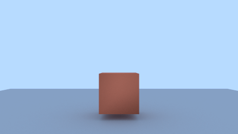
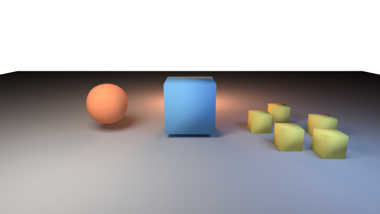
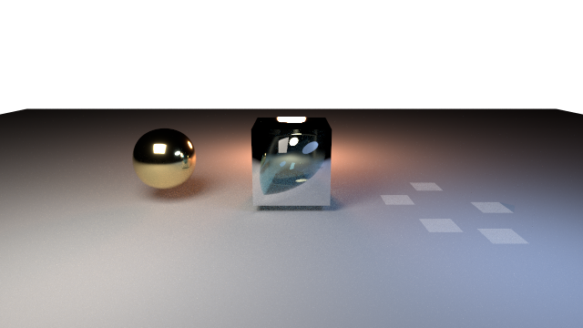
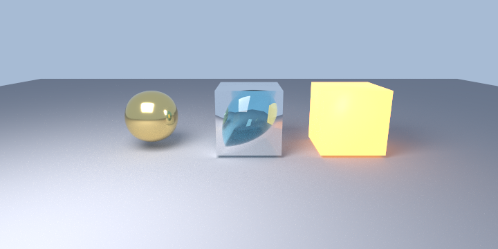
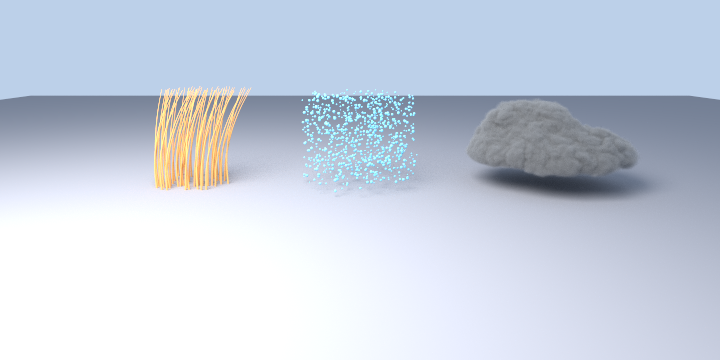
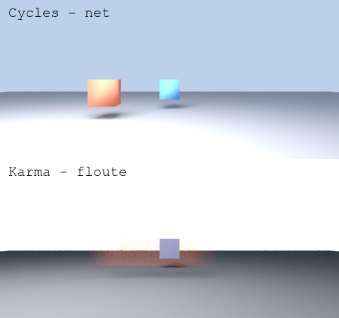
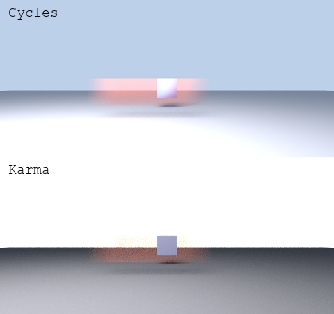

# État d'avancement

## Phase 0 — Build ✅

Cycles 5.2 (`3b97e190`) compile et s'installe contre **Houdini 22.0.368 / USD 26.05**.

- Configuration CMake : aucune erreur, aucun conflit TBB/OIIO/OpenVDB.
- Un correctif nécessaire : `patches/0001-FindUSDHoudini-add-hdsi.patch`.
- Sortie : `install/houdini/dso/usd/hdCycles.dll` (10 Mo) + `plugInfo.json`
  + package `cycles.json`.

Lancement :

    $env:PXR_PLUGINPATH_NAME = "<projet>/install/houdini/dso/usd_plugins"

`husk --list-renderers` affiche alors `HdCyclesPlugin (Cycles)`, **non marqué
"unsupported"**.

## Phase 1 — Delegate enregistré ✅

## Phase 2 — Première image ✅

Rendu par : `husk --renderer HdCyclesPlugin --camera /world/camera --res 480 270
--output geo.exr geo_only.usda`

Validé : mesh polygonaux, transforms, DomeLight (couleur + intensité),
displayColor, ombres de contact, path tracing sur 128 threads
(Threadripper 3995WX), échantillonnage adaptatif.

## Phase 3 — Lumières, instancing, subdivision ✅

Validé sur `tests/usd/phase3.usda` :

- **Subdivision Catmull-Clark** — le cube de gauche est rendu comme une sphère
  lisse, le cube central (`subdivisionScheme = "none"`) reste dur.
- **PointInstancer** — les 5 instances sont rendues, avec la couleur du
  prototype (après correctif 0003).
- **RectLight, DiskLight, SphereLight** — les trois contribuent, avec leurs
  couleurs et leurs ombres douces respectives.
- **displayColor** par objet.

Méthode : chaque résultat est contre-vérifié en rendant la même scène avec
Karma. C'est ce qui a permis de distinguer un vrai bug du delegate (0003) d'une
scène de test mal écrite.

## Phase 4a — Nœuds Cycles natifs dans USD ✅

**161 nœuds Cycles** sont publiés dans le registre Sdr d'USD (patch 0004), avec
leurs types, valeurs par défaut et options d'enum lues du registre Cycles.

L'image ci-dessus est rendue depuis des matériaux authorés **en nœuds Cycles
natifs** dans un fichier USD : `cycles_principled_bsdf` en or métallique
(`metallic=1`, `roughness=0.12`) et en verre (`transmission_weight=1`,
`ior=1.45`).

Prérequis découvert : les meshes doivent porter le schéma appliqué
`MaterialBindingAPI`. Sans lui, `rel material:binding` est silencieusement
ignoré et la géométrie retombe sur `default_surface` — le rendu est correct
mais sans aucun matériau, ce qui est trompeur.

## Phase 4b — Traduction MaterialX ✅

Les trois objets ci-dessus sont rendus depuis des matériaux **MaterialX**
`ND_standard_surface_surfaceshader` : métal (`metalness=1`,
`specular_roughness=0.14`), verre (`transmission=1`, `specular_IOR=1.45`) et
émission (`emission=2.5`).

Implémenté dans le patch 0006, en réutilisant la machinerie de mapping déjà
présente pour `UsdPreviewSurface` plutôt qu'en créant une seconde. Les noms de
sockets Cycles ont été relevés depuis le registre Sdr construit en phase 4a —
pas devinés.

La couche est volontairement un bloc auto-contenu dans `material.cpp` :
supprimable d'une pièce le jour où Cycles absorbera MaterialX, comme prévu au
départ. `src/mtlxCycles` n'a donc pas lieu d'être, la greffe sur l'existant
étant plus courte et plus cohérente.

Couvert : `standard_surface`, `image`, `normalmap`, `texcoord`. Les entrées
MaterialX sans équivalent Cycles (`base`, `transmission_color`,
`subsurface_color`, `transmission_extra_roughness`) sont délibérément non
mappées et ignorées — c'est documenté dans le code.

## Phase 5 — Curves, points, volumes ✅

Validé sur `tests/usd/phase5.usda` :

- **BasisCurves** — 60 courbes cubiques bspline, largeurs dégressives par
  vertex, rendues comme des cheveux natifs Cycles.
- **Points** — 900 points, largeurs variables.
- **Volume OpenVDB** — le `cloud.vdb` livré avec Houdini, chargé via un prim
  `OpenVDBAsset`, avec auto-ombrage et ombre portée.

Le volume ne s'affichait pas au premier essai. Les logs montraient pourtant la
texture NanoVDB allouée (3,45 Mo) — mais aussi `Use Volume False` et
`0 volume octree(s)`. Cause : un volume sans matériau recevait le shader de
surface par défaut. Corrigé par le patch 0007.

## Phase 6 — AOVs ✅ / motion blur ⚠️

### AOVs : validés

`tests/usd/phase6_aov.usda` produit quatre RenderProducts distincts, tous
corrects et non triviaux :

| AOV | Canaux | Contrôle |
|---|---|---|
| `C` (color) | 4 (RGBA) | max 11,86 — le cube émissif |
| `Pz` (depth) | 1 | max 1e10 sur le fond, la profondeur « infinie » standard |
| `N` (normal) | 3 | valeurs bornées à ±1, normales normalisées |
| `primId` | 1 | max 4 pour 5 prims, identifiants 0..4 |

Les alias de nommage Houdini (`C`, `Pz`, `N`) passent par le patch 0002.

### Motion blur d'objet : absent

Voir l'anomalie A7 ci-dessous.

## Phase 9 — Réglages de rendu et packaging ✅

### Réglages exposés

Le delegate accepte, depuis un prim `RenderSettings` USD :

| Clé | Effet |
|---|---|
| `cycles:samples` | nombre d'échantillons |
| `cycles:device` | CPU / CUDA / OPTIX… |
| `cycles:threads` | threads CPU |
| `cycles:time_limit` | limite de temps |
| `cycles:sample_offset` | décalage d'échantillons |
| `cycles:integrator:<socket>` | **tout** socket de l'intégrateur |

Vérifié : `cycles:samples = 24` rend bien 24 échantillons contre 1024 par
défaut ; `cycles:integrator:max_bounce` à 0 contre 12 change la luminance
moyenne comme attendu (perte de l'illumination indirecte).

⚠️ Les noms de sockets sont ceux de Cycles, pas ceux de l'UI Blender :
c'est **`max_bounce`** au singulier, pas `max_bounces`. Un nom erroné était
ignoré sans un mot — le patch 0008 ajoute un avertissement.

La liste complète des sockets disponibles se lit dans
`external/cycles/src/scene/integrator.cpp`.

### Packaging

`install/houdini/` contient désormais :

- `packages/cycles.json` — package Houdini (généré par le build amont)
- `UsdRenderers.json` — label de menu et défauts husk (patch 0008)
- `dso/usd/hdCycles.dll` + `dso/usd_plugins/hdCycles/` — le delegate et son manifeste

Installation : copier `install/houdini/packages/cycles.json` dans
`%USERPROFILE%/Documents/houdini22.0/packages/`.

**Reste à vérifier par toi** : l'effet de `UsdRenderers.json` sur le menu de
renderers de Solaris ne se constate que dans l'interface.

## Anomalies ouvertes

### A1 — Surfaces implicites non supportées (confirmé)

`kSupportedRPrimTypes` (`src/hydra/render_delegate.cpp:40`) ne liste que
`basisCurves`, `mesh`, `points`, `volume`. Un prim `Sphere` USD est
silencieusement absent du rendu ; un `Mesh` explicite au même endroit
s'affiche correctement.

Impact réel modéré (la géométrie venant des SOPs arrive en mesh), mais toute
scène USD tierce contenant Sphere/Cube/Cylinder/Cone/Capsule perdra ces prims
sans avertissement.

Piste : s'assurer que `UsdImagingImplicitSurfaceSceneIndex` est bien inséré
dans la pipeline husk d'Houdini 22, sinon déclarer les types et mailler
nous-mêmes.

### A2 — RenderVar Houdini → image noire ✅ RÉSOLU (patch 0002)

husk transmet `driver:parameters:aov:husk:name` comme nom d'AOV Hydra. La
convention Houdini pour la beauty étant `"C"`, le binding n'était pas mappé,
la liste de bindings restait vide, `IsConverged()` retournait vrai
immédiatement et husk écrivait une frame vierge — **sans le moindre
avertissement**.

Diagnostic obtenu par bissection : RenderSettings seuls → OK ; ajout du
RenderProduct + RenderVar → noir ; `husk:name = "color"` → OK.

### A3 — displayColor perdu sur les instances ✅ RÉSOLU (patch 0003)

Index `_instances[0]` codé en dur. Voir `patches/README.md`.

### A4 — Matériau à émission seule : invisible à la caméra

Un `Material` dont le terminal `outputs:cycles:surface` est connecté
directement à un nœud `cycles_emission` **émet bien de la lumière** (la lueur
colorée est visible sur les surfaces alentour) mais l'objet lui-même est
**totalement invisible aux rayons caméra**.

La même émission passée par les entrées `emission_color` / `emission_strength`
d'un `cycles_principled_bsdf` rend un objet lumineux visible, normalement.

Le défaut est donc spécifique au nœud `emission` employé seul comme terminal de
surface, et non à l'émission en général. Cause racine non déterminée — piste :
la construction du graphe côté `material.cpp`, la fermeture d'émission étant
visiblement prise en compte par l'arbre de lumières mais pas raccordée à la
sortie de surface.

Reproduction : `tests/usd/emit_test.usda` (invisible) contre
`tests/usd/pemit_test.usda` (correct).

### A5 — Crash sur matériau MaterialX ✅ RÉSOLU (patch 0005)

La simple présence d'un matériau MaterialX dans le stage provoquait un
segmentation fault, lié ou non à une géométrie. Karma rendait le même fichier
sans problème.

Cause racine : `Shader::tag_update()` déréférence `graph` sans vérification,
et un matériau dont la network est illisible n'atteint jamais `set_graph()`.
Corrigé en semant un graphe vide à la création du shader.

Localisé par instrumentation progressive (`fprintf` sur stderr — `TF_WARN` est
avalé par husk), en bissectant jusqu'à l'instruction.

Reproduction : `tests/usd/repro_mtlx_crash.usda`, 80 lignes.

Suite livrée en phase 4b : `mtlx` est désormais déclaré comme contexte de
rendu et les réseaux MaterialX sont traduits (patch 0006).

## Organisation des correctifs

Les modifications de Cycles vivent sur la branche `houdini-fixes` du clone, en
commits séparés par sujet, exportés dans `patches/` par `git format-patch`.
Réapplication après un pull amont : `git am ../../patches/*.patch`.

## Non-régression

Batterie rejouée après chaque build, toutes en exit 0 :

| Scène | Couvre |
|---|---|
| `phase4b_mtlx.usda` | MaterialX standard_surface (métal, verre, émission) |
| `phase4_materials.usda` | nœuds Cycles natifs via Sdr |
| `phase3.usda` | lumières, PointInstancer, subdivision |
| `repro_mtlx_crash.usda` | non-régression du crash A5 |

Méthode retenue tout du long : **contre-vérifier chaque résultat en rendant la
même scène avec Karma**. C'est ce qui a permis de distinguer les vrais bugs du
delegate de mes propres scènes de test mal écrites — et de rattraper au moins
une conclusion erronée.

### A7 — Motion blur d'objet ✅ RÉSOLU (patch 0010)

Résolu. Détail dans `patches/README.md`. Ce qui suit décrit l'état initial.

Diagnostic d'origine

Seule la **caméra** a du motion blur : `camera.cpp` échantillonne sa transform
sur l'obturateur et appelle `cam->set_motion()`. Pour la géométrie,
`geometry.inl` ne lit qu'un seul échantillon :

    _geomTransform = matrixDs->GetTypedValue(0.0f);

Vérifié sur `tests/usd/phase6_mblur.usda` : un cube animé de x=-2,5 à x=+2,5
sur l'obturateur est rendu **parfaitement net** par Cycles, à sa position
d'ouverture, là où Karma l'étale sur toute sa trajectoire.

Ce qu'il faut pour le corriger, et pourquoi ce n'est pas un petit patch :

1. Faire remonter l'intervalle d'obturateur de la caméra jusqu'à la
   synchronisation des rprim — ni `HdCyclesSession` ni `HdCyclesCamera` ne
   l'exposent aujourd'hui.
2. Gérer l'ordre de synchronisation : rien ne garantit que la caméra soit
   synchronisée avant la géométrie, donc l'application du flou doit être
   différée ou rejouée.
3. Poser `Object::set_motion()`, `Geometry::set_use_motion_blur()` et
   `set_motion_steps()` de façon cohérente.
4. Le flou de déformation (points animés sur mesh et courbes) est un chantier
   distinct de celui du flou de transformation.

Un flou subtilement faux serait pire que pas de flou du tout, donc cette
fonctionnalité mérite son propre créneau plutôt qu'un ajout en fin de phase.

### A8 — Flou de déformation et attributs de vélocité

Le patch 0010 couvre le flou de **transformation** d'objet. Restent à faire :

- le flou de **déformation** : points animés sur mesh et courbes, via les
  attributs de motion Cycles (`ATTR_STD_MOTION_VERTEX_POSITION`) ;
- le flou par **attributs `velocities` / `accelerations`**, comme le fait Karma.
  Cycles n'a pas de notion native de vélocité : il faut synthétiser les
  positions aux étapes de motion (`P + v·dt`, plus `½·a·dt²` si l'accélération
  est présente) et remplir l'attribut de motion.

C'est en réalité le chemin le plus **simple** des deux, puisqu'il ne demande
aucun échantillon temporel supplémentaire au scene delegate : la vélocité
arrive comme un primvar ordinaire à un seul instant. C'est aussi le plus utile
en pratique, les simulations Houdini transportant `v` presque toujours.

### A9 — Crash du viewport Solaris ✅ CAUSE TROUVÉE (patch 0011)

Verrouillage déséquilibré dans le display driver : `gl_context_disable()`
déverrouillait `mutex_` même quand `gl_context_enable()` avait échoué **sans
l'avoir verrouillé**. Déverrouiller un mutex non possédé est un comportement
indéfini, et fait tomber Houdini.

Ce chemin n'est atteint que quand le contexte GL manque — donc exactement quand
le driver signale `could not begin update`. Le message d'erreur et le segfault
étaient **le même défaut**, pas deux.

Ma première tentative (patch 0009) durcissait la création du contexte : utile,
mais elle traitait la cause de l'erreur, pas celle du crash. Le crash a
persisté, ce qui a permis de chercher au bon endroit.

Détail dans `patches/README.md`. **Reste à confirmer en interface.**
